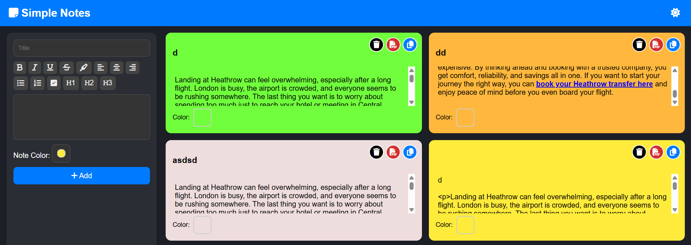

# 📝 Simple Note

**Simple Note** is a lightweight web-based note-taking app with **dark mode**, **text formatting**, and support for exporting & local storage.

🔗 **Live Demo:** [s4rt4.github.io/simplenote](https://s4rt4.github.io/simplenote)

---

## ✨ Features

- 📑 **Create new notes** with title, content, and customizable colors
- 🎨 **Note colors** via color picker
- 🌓 **Dark / Light mode** toggle
- 🔤 **Text formatting toolbar**:
  - Bold, Italic, Underline, Strikethrough
  - Highlight
  - Align (Left, Center, Right)
  - Ordered & Unordered lists
  - Checkbox
  - Heading levels (H1, H2, H3)
- 💾 **Local storage** support (notes persist after page reload)
- 🖊 **Inline editing** → edit note title & content directly with auto-save
- 📎 **Per-note actions**:
  - 🗑 Delete note
  - 📄 Save as PDF
  - 📋 Copy to clipboard
- 📱 **Responsive design** (works on desktop & mobile)

---

## 🚀 How to Use

1. Open the [Live Demo](https://s4rt4.github.io/simplenote).
2. Enter a title & content, choose a color if desired.
3. Click ➕ **Add** to save the note.
4. Use the toolbar buttons to format your text.
5. Notes are automatically saved in your browser.

